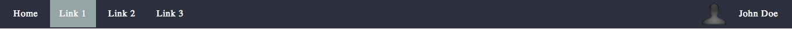

# Boiler-CSS

**What is Boiler-CSS?**
* It's another responsive front-end framework.
* It's like other responsive front-end frameworks, but not.
* It's written in LESS.

Now, I know what you're going to say...
**AREN'T THERE ENOUGH REPONSIVE FRONT-END FRAMEWORKS ALREADY?!!**
Yes, there absolutely are many to choose from. I didn't decide to
build this because I think I can do a better job than a bunch of the
amazing developers at Zurb, Twitter, etc. I decided to build this
purely so I gain all of the knowledge that a developer gains when
they take on such an ardous task. This project has so far helped me
to better grasp the intricacies of CSS and the many problems one
encounters when designing cross-browser and cross-device.

I want this framework to put a strong on semantics, both in the HTML
and the CSS. I also want it have all of the basic features
necessary for bootstrapping a scalable web application,
without including any of the extra styling and bloat-code that come
with many of the other front-end frameworks. Every project I work on
requires different fonts and colors, so I didn't want to lock myself
or anyone else who uses this in the future to have to do any
overwriting.

## Installation

```bash
bower install boiler-css
```

## Development
```base
$ git clone https://github.com/theponti/boiler-css.git

$ npm install

$ gulp
    /**
     * Will start a static server on port 4000 and will
     * start a gulp.watch task for all .less files in src
     * directory
     */
```

## Usage

### Navigation Bar



```html
        <nav class="menu horizontal fixed-top full" role="navigation">
            <a href="#">Home</a>
            <a href="#">Link 1</a>
            <a href="#">Link 2</a>
            <a href="#">Link 3</a>
            <div class="no-v-pad right dropdown">
                
                <a class="inline pad-top-1 height-three" href="#">John Doe</a>
                <div class="dropdown-menu">
                    <a href="#">Profile</a>
                    <a href="#">Log Out</a>
                </div>
            </div>
        </nav>
```

## Now Rock Out!
